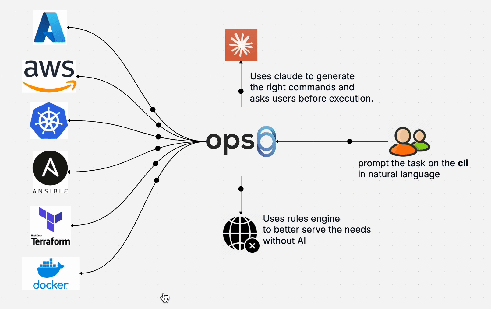
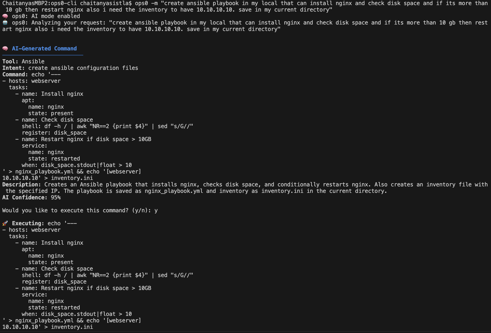

<p align="center">
  
</p>

<p align="center">
  <a href="./README.zh-CN.md">ReadMe in Chinese</a> • 
  <a href="./README.de.md">ReadMe in German</a> • 
  <a href="./README.fr.md">ReadMe in French</a> • 
  <a href="./README.es.md">ReadMe in Spanish</a> • 
  ReadMe in Portuguese • 
  <a href="https://join.slack.com/t/ops0/shared_invite/zt-37akwqb1v-BvfK7AioDlRhje94UN2tkw">Slack Community</a>
</p>

---

<p align="center">
ops0 é uma ferramenta CLI inteligente que transforma linguagem natural em comandos DevOps.<br>
Alimentado por Claude AI, simplifica tarefas complexas de DevOps entendendo sua intenção<br>
e gerando os comandos corretos, tornando o gerenciamento DevOps mais acessível e eficiente.
</p>

## ops0 em Ação


*Veja o ops0 traduzir linguagem natural em poderosos comandos DevOps*

## Início Rápido

### Instalação
```bash
curl -fsSL https://raw.githubusercontent.com/ops0-ai/ops0-cli/main/install.sh | bash
```

### Uso Básico
```bash
# Modo baseado em regras (não requer chave API)
ops0 -m "i want to plan my iac code"

# Modo IA (requer chave API)
export ANTHROPIC_API_KEY=your_key_here
ops0 -m "check if my kubernetes pods are running" -ai

# Modo de solução de problemas
ops0 -m "my terraform apply is failing with state lock" -troubleshoot
```

## Exemplos de Comandos em Ação

Aqui estão alguns exemplos reais do ops0 em ação com diferentes ferramentas:

### Operações AWS CLI

*Exemplo: Gerenciamento de recursos AWS usando linguagem natural*

### Gerenciamento de Contêineres Docker

*Exemplo: Gerenciamento de contêineres e imagens Docker com linguagem simples*

### Automação com Ansible


*Exemplo: Execução e validação simples de playbooks Ansible*

### Infraestrutura com Terraform

*Exemplo: Gerenciamento de infraestrutura como código com linguagem natural*

### Operações Kubernetes

*Exemplo: Gerenciamento simplificado de clusters Kubernetes e solução de problemas*

## Ferramentas e Funcionalidades Suportadas

### Ferramentas Principais
- **Terraform** - Infraestrutura como Código
- **Ansible** - Gerenciamento de Configuração
- **Kubernetes (kubectl)** - Orquestração de Contêineres
- **Docker** - Containerização
- **AWS CLI** - Amazon Web Services
- **Helm** - Gerenciador de Pacotes Kubernetes
- **gcloud** - Google Cloud Platform
- **Azure CLI** - Microsoft Azure
- **System Admin** - Administração de Sistemas Linux

### Exemplos de Administração de Sistema e Análise de Logs
```bash
# Analisar logs de um pod Kubernetes e obter resumo IA com recomendações
ops0 -m "analisar logs do pod my-app-123 no namespace prod"

# Analisar um arquivo de log específico em busca de problemas
ops0 -m "analisar /var/log/nginx/error.log"

# Monitorar recursos do sistema
ops0 -m "mostrar uso de memória na minha máquina"
ops0 -m "verificar espaço em disco"
ops0 -m "mostrar uso de CPU"

# Gerenciar serviços do sistema
ops0 -m "reiniciar serviço nginx"
ops0 -m "verificar status do serviço apache2"

# Gerenciamento de pacotes
ops0 -m "instalar pacote docker"
ops0 -m "atualizar pacotes do sistema"

# Logs do sistema
ops0 -m "mostrar logs do sistema"
ops0 -m "verificar logs journalctl"
```

### Recursos Principais
- Tradução de linguagem natural
- Solução de problemas assistida por IA
- **Análise de logs de pods Kubernetes com resumo IA e comandos sugeridos**
- **Análise de arquivos de log para problemas e contexto**
- Sugestões contextuais
- Execução segura com confirmação
- Suporte de simulação para operações destrutivas
- Instalação automática de ferramentas

## Modo IA vs Modo Regras

| Recurso | Modo Regras | Modo IA |
|---------|------------|---------|
| Configuração | Não requer chave API | Requer ANTHROPIC_API_KEY |
| Velocidade | Instantâneo | ~2-3 segundos |
| Compreensão | Correspondência de padrões | Linguagem natural |
| Consciência contextual | Limitada | Alta |
| Solução de problemas | Básica | Avançada |
| Cenários complexos | Limitado | Excelente |
| Uso offline | ✅ | ❌ |

## Configuração

### Variáveis de Ambiente
```bash
# Necessário para recursos de IA
export ANTHROPIC_API_KEY=your_api_key

# Opcional: Personalizar comportamento da IA
export OPS0_AI_MODEL=claude-3-sonnet-20240229  # Modelo padrão
export OPS0_MAX_TOKENS=1024                    # Comprimento da resposta
```

## Privacidade e Segurança

- **Chave API**: Armazenada localmente como variável de ambiente
- **Sem Armazenamento de Dados**: Comandos e contexto não são armazenados pelo ops0
- **Privacidade Anthropic**: Segue as políticas de tratamento de dados da Anthropic
- **Processamento Local**: Modo regras funciona completamente offline

## Roteiro

### Atual
- [x] Integração Claude AI
- [x] Modo básico de solução de problemas
- [x] Consciência contextual
- [x] Suporte multi-ferramentas

### Em Breve
- [ ] Modelo personalizado para ambientes offline
- [ ] Fluxos de trabalho interativos multi-etapas
- [ ] Aprendizado com feedback do usuário
- [ ] Configurações personalizadas de ferramentas
- [ ] Suporte para múltiplos provedores de IA
- [ ] Análise contextual avançada
- [ ] Recursos de colaboração em equipe

## Dicas

1. **Seja Específico**: "Meu plano terraform mostra 5 recursos alterando" vs "erro terraform"
2. **Use o Modo de Solução de Problemas**: Para problemas complexos, use a flag `-troubleshoot`
3. **Verifique o Contexto**: A IA funciona melhor no diretório correto
4. **Revise os Comandos**: Sempre revise as sugestões da IA antes de confirmar
5. **Forneça Feedback**: Use GitHub Issues para reportar problemas de precisão da IA 