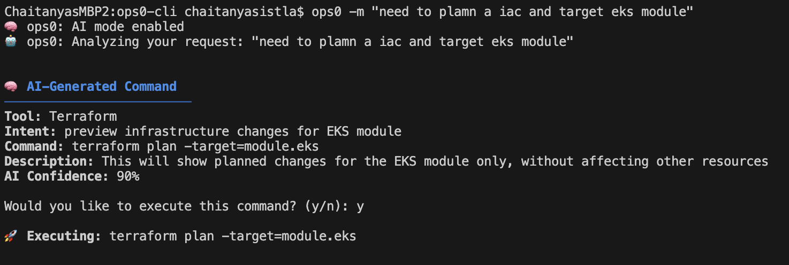

<p align="center">
  
</p>

<p align="center">
  <a href="./README.md">English</a> •
  <a href="./README.zh-CN.md">简体中文</a> •
  <a href="./README.de.md">Deutsch</a> •
  <a href="./README.fr.md">Français</a> •
  <a href="./README.es.md">Español</a> •
  <a href="./README.pt-BR.md">Português</a>
</p>

---

<p align="center">
ops0 是一个智能命令行工具，可以将自然语言转换为 DevOps 命令。<br>
由 Claude AI 提供支持，它通过理解您的意图来简化复杂的 DevOps 任务，<br>
生成正确的命令，使 DevOps 管理更加便捷高效。
</p>

## ops0 演示


*观看 ops0 如何将自然语言转换为强大的 DevOps 命令*

## 快速开始

### 安装
```bash
curl -fsSL https://raw.githubusercontent.com/ops0-ai/ops0-cli/main/install.sh | bash
```

### 基本用法
```bash
# 规则模式 (无需 API 密钥)
ops0 -m "i want to plan my iac code"

# AI 支持模式 (需要 API 密钥)
export ANTHROPIC_API_KEY=your_key_here
ops0 -m "check if my kubernetes pods are running" -ai

# 故障排除模式
ops0 -m "my terraform apply is failing with state lock" -troubleshoot
```

## 命令示例展示

以下是 ops0 在不同工具中的实际应用示例：

### AWS CLI 操作

*示例：使用自然语言命令管理 AWS 资源*

### Docker 容器管理

*示例：使用简单的中文管理 Docker 容器和镜像*

### Ansible 自动化

*示例：轻松执行和验证 Ansible playbook*

### Terraform 基础设施

*示例：使用自然语言管理基础设施即代码*

### Kubernetes 操作

*示例：简化的 Kubernetes 集群管理和故障排除*

## 支持的工具和功能

### 核心工具
- **Terraform** - 基础设施即代码
- **Ansible** - 配置管理
- **Kubernetes (kubectl)** - 容器编排
- **Docker** - 容器化
- **AWS CLI** - 亚马逊云服务
- **Helm** - Kubernetes 包管理器
- **gcloud** - 谷歌云平台
- **Azure CLI** - 微软 Azure

### 主要功能
- 自然语言命令转换
- AI 驱动的故障排除
- 上下文感知建议
- 安全执行确认
- 破坏性操作的预演支持
- 自动工具安装

## AI 模式与规则模式对比

| 功能 | 规则模式 | AI 模式 |
|---------|------------|---------|
| 设置 | 无需 API 密钥 | 需要 ANTHROPIC_API_KEY |
| 速度 | 即时 | 约 2-3 秒 |
| 理解能力 | 模式匹配 | 自然语言 |
| 上下文感知 | 有限 | 高 |
| 故障排除 | 基础 | 高级 |
| 复杂场景 | 有限 | 优秀 |
| 离线使用 | ✅ | ❌ |

## 配置

### 环境变量
```bash
# AI 功能必需
export ANTHROPIC_API_KEY=your_api_key

# 可选：自定义 AI 行为
export OPS0_AI_MODEL=claude-3-sonnet-20240229  # 默认模型
export OPS0_MAX_TOKENS=1024                    # 响应长度
```

## 隐私与安全

- **API 密钥**：本地存储为环境变量
- **无数据存储**：ops0 不存储命令和上下文
- **Anthropic 隐私**：遵循 Anthropic 的数据处理政策
- **本地处理**：规则模式完全离线工作

## 路线图

### 当前
- [x] Claude AI 集成
- [x] 基础故障排除模式
- [x] 上下文感知
- [x] 多工具支持

### 即将推出
- [ ] 支持离线环境的自定义模型
- [ ] 交互式多步工作流
- [ ] 从用户反馈中学习
- [ ] 自定义工具配置
- [ ] 多 AI 提供商支持
- [ ] 高级上下文分析
- [ ] 团队协作功能

## 使用技巧

1. **具体描述**：使用"我的 terraform plan 显示 5 个资源更改"而不是"terraform 错误"
2. **使用故障排除模式**：对于复杂问题，使用 `-troubleshoot` 标志
3. **检查上下文**：在正确的目录中使用 AI 效果更好
4. **检查命令**：在确认之前始终检查 AI 建议
5. **提供反馈**：使用 GitHub issues 报告 AI 准确性问题 